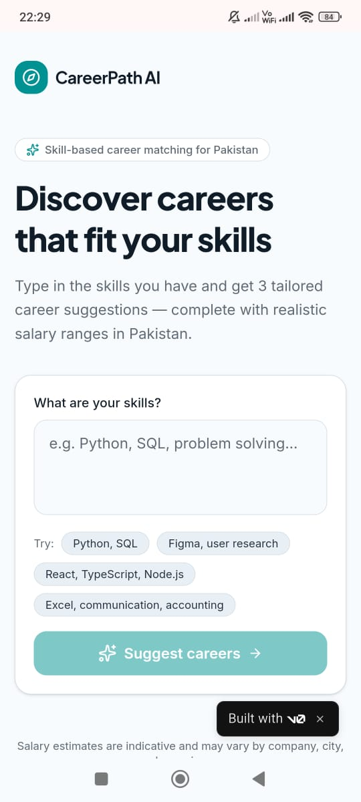
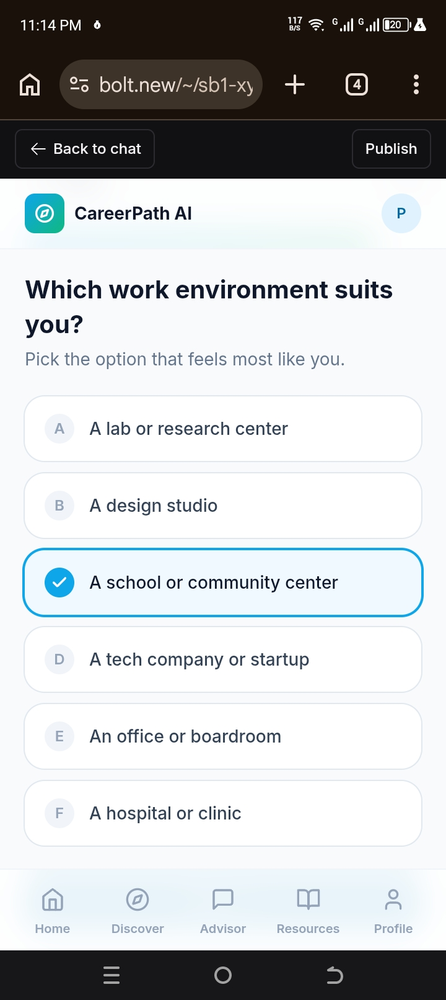
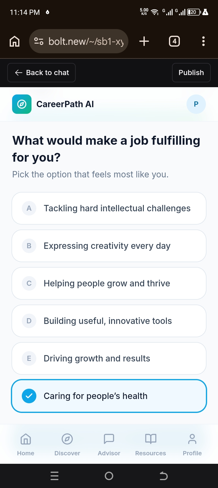
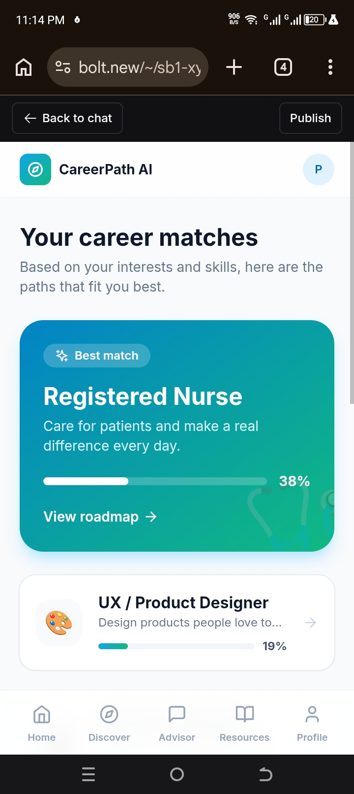

# Career Path AI

## 1. App Name + Real Problem
Career Path AI ek AI powered app hai jo students aur fresh graduates ko unke skills, interests aur goals ki base pe behtareen career path suggest karti hai. Pakistan me bachon ko pata nahi hota unke liye kaunsa field best hai.

## 2. LIVE URL
https://career-path-ivory.vercel.app/

## 3. Features
- Home page with career quiz start button
- AI Career Quiz: Skills, Interests, Goals ke 3 sawal
- Personalized Career Recommendations with salary + scope
- Learning Resources: Har career ke liye courses aur skills
- Save/Download Career Report
- Mobile Responsive Design

## 4. AI Feature Details
AI user se 3 sawal poochta hai:
1. Aapki top 3 skills kya hain?
2. Aapko kis cheez me interest hai?
3. Aapka 5 saal ka career goal kya hai?
Phir AI 3 best career options deta hai reason + next steps ke sath.
**Prompt used**: "Create a career guidance web app called Career Path AI. Ask user 3 questions about skills, interests, goals. Then recommend 3 career paths with explanation, required skills, and learning resources."

## 5. Tools Used
Google AI Studio, Gemini 2.5, Vercel, React, Tailwind CSS

## 6. Screenshots

## 6. Screenshots

### Home Page / AI Quiz

### Career Results 1

### Career Results 2

### Vercel Deploy

### Career Results

## 7. How to Run Locally
1. git clone <repo-link>
2. npm install
3. npm run dev# CareerpathAi-
AI powered career guidance app that helps users discover suitable career paths based in their skills,interests, and goals.
